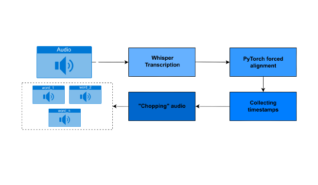

<div align="center">
    
    <p>Package designed for word-level audio segmentation. It combines two techniques, <a href="https://github.com/openai/whisper">Whisper Transcription</a> and
<a href="https://pytorch.org/audio/stable/tutorials/forced_alignment_tutorial.html">PyTorch forced alignment</a>.  <i>Prepared based on the utilities I needed for my research. <i></p>
</div>
<h2>Workflow</h2> 
<div align="center">
    
</div>

<h2>🎤 Installation 🎤</h2> 

ToDo: Install using pip
```bash
pip install chatterchop
```
Alternatively,
* Clone the repo: `git clone https://github.com/najdamikolaj00/ChatterChop.git`
* Navigate to the repo: `cd chatterchop`
* Install the repo: `pip3 install .`
[<h2> Showcase (short words such as "the" need a bit of work) Turn audio on 📢<h2>

https://github.com/najdamikolaj00/ChatterChop/assets/62188847/faa4012a-6b34-4999-8227-35fb2da7c4dc

https://github.com/najdamikolaj00/ChatterChop/assets/62188847/35e75e45-3ec5-4cc1-ba80-938892459305

https://github.com/najdamikolaj00/ChatterChop/assets/62188847/cbcf1ebc-2223-480e-b1c6-b68a0701cf4a

https://github.com/najdamikolaj00/ChatterChop/assets/62188847/09181b60-4963-4887-9ca1-819522f9079b

and so on...
audio source:
Walden, Patrick R (2020), “Perceptual Voice Qualities Database (PVQD)”, Mendeley Data, V1, doi: 10.17632/9dz247gnyb.1
<h2>🐊 Tutorial 🐊</h2> 

```
|-- chatterchop/
|   |-- tutorial/
|   |   |-- ChatterChop.py
```
<h3>Example 1 (chopping chatter;))</h3> 

```python
from chatterchop.chop import ChatterChop

#Polish example: Create an object with a path to audio, and provide a path to the output directory to save segmented samples.

test_audio_path_pl = 'data_to_test/test_pl/test_audio_pl.wav'
output_dir_pl = 'data_to_test/test_pl/test_split_pl'

test_obj_pl = ChatterChop(test_audio_path_pl)

test_obj_pl.chop_chatter()

test_obj_pl.save_speech_segments(output_dir_pl)

#English example: Create an object with a path to audio, and provide a path to the output directory to save segmented samples.

test_audio_path_eng = 'data_to_test/test_eng/test_audio_eng.wav'
output_dir_eng = 'data_to_test/test_eng/test_split_eng'

test_obj_eng = ChatterChop(test_audio_path_eng)

test_obj_eng.chop_chatter()

test_obj_eng.save_speech_segments(output_dir_eng)

```
<h3>Example 2 (getting transcription and metrics)</h3> 

```python
from chatterchop.chop import ChatterChop

test_audio_path = 'data_to_test/test_audio_pl_shorter.wav'
test_ground_truth_path = 'data_to_test/test_transcription_ground_truth.txt'

#Option 1: Create an object with just a path to audio, and provide a ground truth transcript as a path to a file, get transcription accuracy and save transcription to a text file.
test_obj_1 = ChatterChop(test_audio_path)


transcription_result = test_obj_1.get_transcription_accuracy(test_ground_truth_path)
print(transcription_result)

test_obj_1.save_transcription('data_to_test/saved_trans.txt')

#Option 2: Create an object with a path to audio and transcription, and provide a ground truth transcript as a path to a file to get transcription accuracy.
test_obj_2 = ChatterChop(test_audio_path, test_transcription_file)


transcription_result = test_obj_2.get_transcription_accuracy(test_ground_truth_path)
print(transcription_result)

#Option 3: Create an object with a path to audio and transcription, and provide a ground truth transcript as a string to get transcription accuracy.
test_obj_3 = ChatterChop(test_audio_path, test_transcription_file)

test_ground_truth = 'Warszawa jest pełnym sprzeczności przez wielu niezniszczalnym.'
transcription_result = test_obj_3.get_transcription_accuracy(test_ground_truth)
print(transcription_result)

```
<h3>TO DO:</h3>
-Tests
-Other languages
-Converting numbers to appropriate words
-Different use cases etc.
